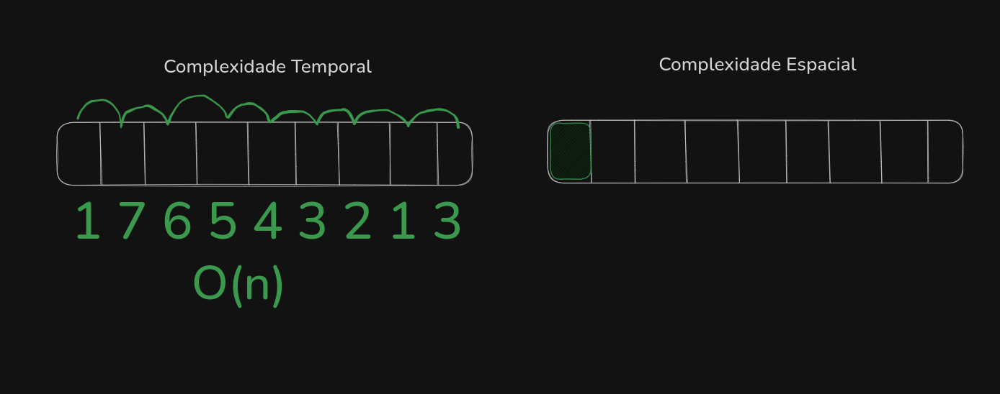
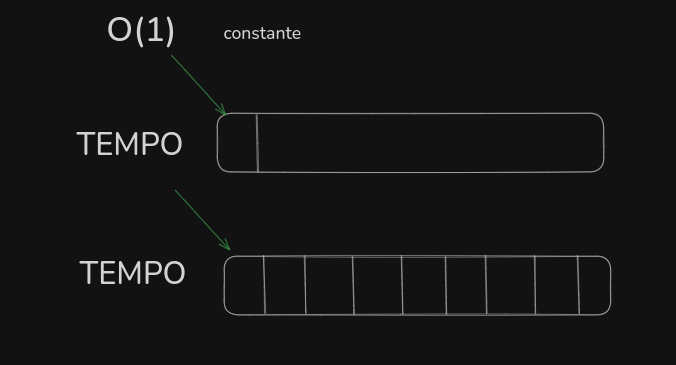
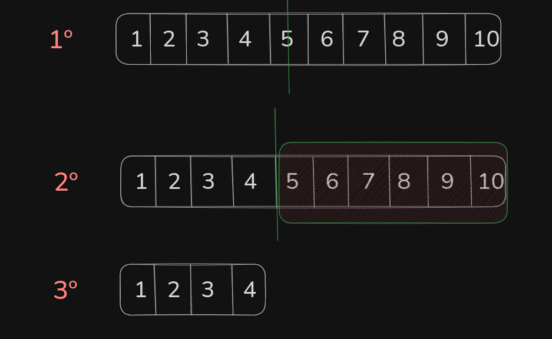
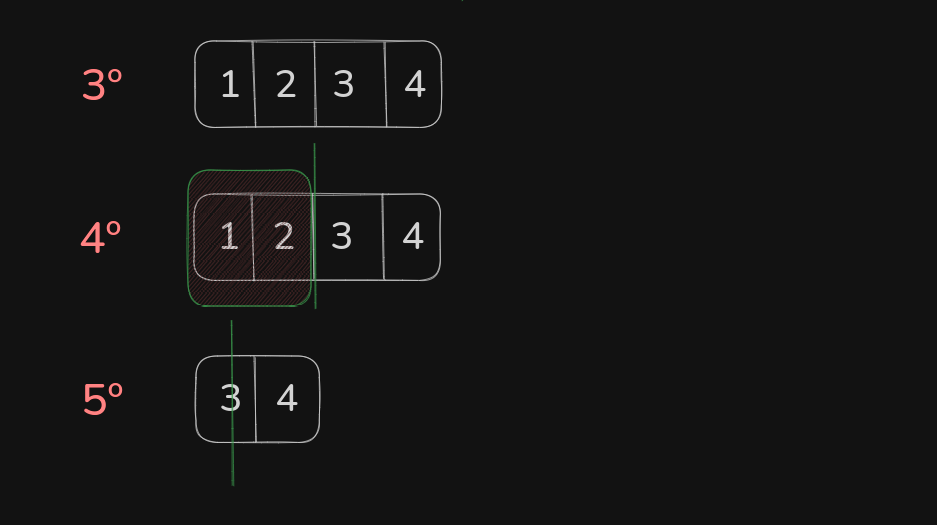
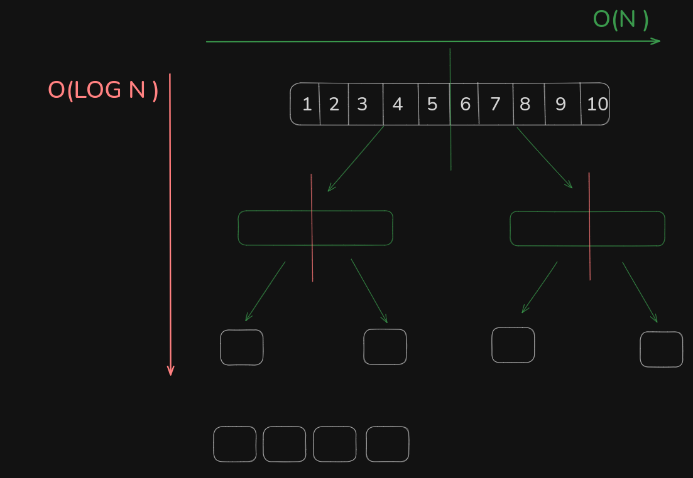

# Algorithms & Big O Notation

Este diretório contém estudos de algoritmos, estruturas de dados e análise de complexidade (Big O Notation).

## Big O Notation

> é sobre escalabilidade, e não necessariamente performance

Big O, vai dizer o quão bem ou o qual mal o algoritimo escala dado o tamanho de um input.

Além disso, serve para medirmos a **Complexidade Temporal** e **Complexidade Espacial**:

Por exemplo em um algoritimo onde percorremos todos os itens de um array uma unica vez buscando o maior valor, temos **O(n) como complexidade Temporal** e O(1) de Complexidade Espacial por que alocamos apenas um unico espaço na memoria:



`1º execução`**:** o MAIOR valor é 1, alocamos um espaço na memoria com esse valor;

`2º execução` **:** verificamos que o “7” é maior, portanto substiuimos o valor anterior;

`3º execução` **:** o “7” continua sendo o maior;

`4º execução` **:** o “7” continua sendo o maior;

Isso se repete N vezes até chegar ao fim do array, portanto independente de se encontrar o maior valor na primeira execução ou na ultima o tempo será o mesmo e a alocação na memoria tambem, portanto:

**Complexidade Temporal ⇒ tempo de execução (runtime)**

**Complexidade Espacial ⇒ quanto de memoria adicional precisamos adicionar**

portanto, quando falamos de Big O, falamos de escalabilidade e não necessariamente performance

### O(1)

é quando independente do tamanho do array, seja ele um trilhão de items ou de 20 items, o tempo de execução é o mesmo e a alocação na memoria é constante, ou seja, é igual sempre.

Um exemplo, é buscar o primeiro elemento do array:



independente do tamanho do array o tempo de execução será o mesmo, sendo O(1)

se quisermos buscar os 15 maiores elementos do array, a Complexidade Espacial permanece a mesma, pois a quantidade de items a serem alocados em um array de 20 elementos e de 1.000, será os mesmos 15 elementos. Por isso é O(1).

### O ( LOG N )

isso siginifca que conforme dobramos o input (N) o tempo de execução não dobra, ele apenas aumenta alguns segundos.

Por exemplo usando log (não precisar saber a conta):

```tsx
Log(10) => 3,321928
Log(20) => 4,321928
Log(30) => 5,321928
```

podemos perceber que mesmo dobrando o input o tempo apenas aumentou em 1, aumentando de forma linearmente.

Uma busca binaria (binary search) é O ( LOG N), considerando que o array já está ordenado, a busca binaria vai separar no meio e ver se o item no meio é maior ou menor que o elemento que estamos buscando.

Queremos encontrar o elemento 3, portanto faremos o seguinte:



- Selecionamos o meio do array
- Verifcamos se o 5 > 3 ou 5 < 3, nesse caso maior, portanto do 5 para frente removemos
- Sobrou somente [ 1, 2, 3. 4 ]



- Selecionamos o meio do array
- Verifcamos se o 2 > 3 ou 2 < 3, nesse caso menor, portanto do 2 para tras removemos
- Sobrou somente [ 3, 4 ]
- Selecionamos o meio do array e econtramos o 3

OBS: na maiora dos algoritimos como esse pegamos o valor anterior se não tiver meio, por exemplo, não existe meio entre 3 e 4, portano pegamos o 3.

### O ( N )

é o mais simples, perccore o array até encontrar o valor, por exemplo, queremos encontrar o valor “3”, vai encontrar relativamente rápido para encontrar, pois está no começo do array, portanto não podemos afirmar que a melhor perfocemance.


sempre devemos considerar o caso pessimista, nesse caso buscar o valor 10. Podemos que buscar o valor “10” demora mais do que buscar o valor “3”, pois temos que percorrer todo array até chegar no “10”;

Portanto, se eu dobrar o input, o tempo de execução tambem dobra, pois estamos considerando o pior cenario.

### O ( N LOG N )

Algoritimos com esse Big O:

- Sorting
- Divide and Conquer

esse normalmente é usado em algoritimos de “sorting”, por exemplo o de mergesort, onde separamos um array no meio, pegamos as duas partes e separamos no meio novamente, e reptimos até sobrar um unico elemento em cada array:


basicamente: divide, faz um oredenação, divide, faz uma ordenação.

ele vai percorrer o array N vezes, essa parte de comparar um com o outro é o O(N), porem ele faz isso recurssivamente, portanto irá se reptir varias vezes, fazendo um que o algoritimo tenha uma profundidade de O ( LOG N )



### O ( n^2 )

Basicamente é um loop dentro de um loop, de forma pratica é:

para cada item do array ele confere todos os outros items:

```tsx
for () {
 	for () {}
}
```
