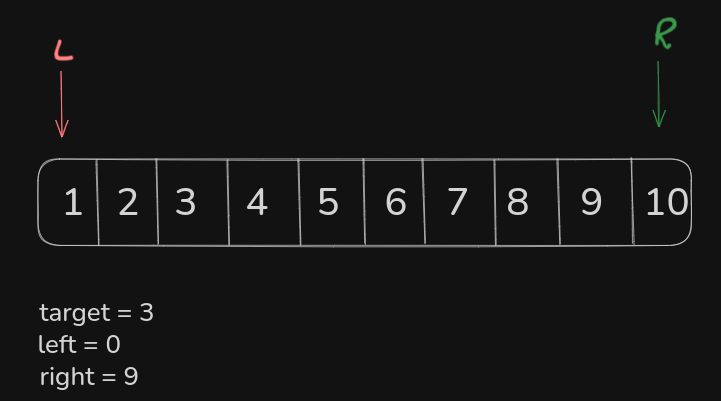
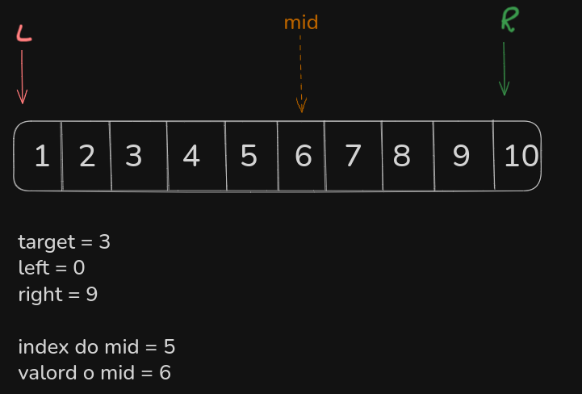
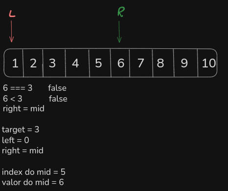
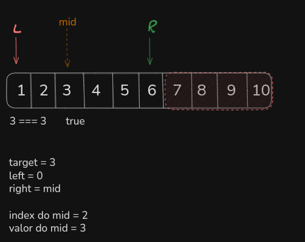

# Binary Search

na busca binaria buscamos o valor em array ordenado, e o que fazemos é inciar com um ponteiro na esquerda e um na direita, enquanto o esquerdo for menor que o direito o algoritimo fica em loop.



apos colocarmos os ponteiros nas extremidades vamos encontrar o meio com o seguinte conta:

```tsx
esquerda + direita / 2;
```



sabendo o valor do meio, verificamos se é o valor alvo que buscamos, se não for verificamos se o meio é menor que o valor que buscamos, se não deixamos o valor do ponteiro da direita igual ao mid:



na etapa seguinte vamos encontrar o valor(3) que buscamos no meio:



e vai cair na primeira verificação, encerrando o algoritimo:

```tsx
function search(nums: number[], target: number): number {
  let left = 0;
  let right = nums.length;

  while (left < right) {
    let mid = Math.floor((left + right) / 2);

    if (nums[mid] === target) {
      return mid;
    } else if (nums[mid] < target) {
      left = mid + 1;
    } else {
      right = mid;
    }
  }

  return -1;
}
```
