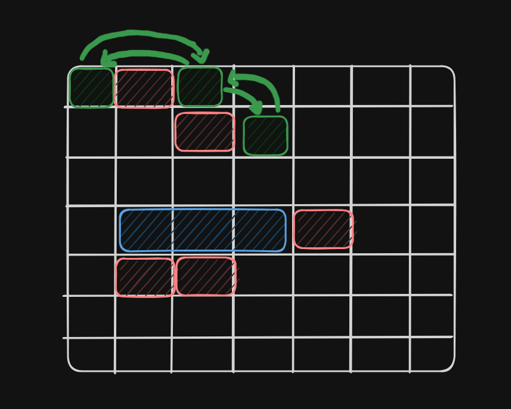

# Linked List

é um estrutura de dados onde o elemento (chamados de nós ou nodes) são armazenados em posições independentes na memoria e ligados entre si por referencias (ou ponteiros);



em vez de ficarem lado a lado com um array(azul), cada nó(em verde) guarda:

- O valor / dado
- Um ponteiro ( ou referencia ) para o próximo nó na sequencia

basicamente:

```tsx
[valor|ponteiro] => [valor|ponteiro] => [valor|ponteiro] => null
```

**Head**: primeiro elemento da lista

**Tail**: último elemento da lista (que aponta para `null`)

Cada nó “aponta” para o próximo, criando a ligação.

### Tipos comuns

- **Singly Linked List**: cada nó aponta apenas para o próximo.
- **Doubly Linked List**: cada nó aponta para o próximo **e** para o anterior.
- **Circular Linked List**: o último nó aponta de volta para o primeiro, formando um ciclo.

Diferenças entre Array X Linked Lists

| Arrays                                                     | Linked Lists                                                              |
| ---------------------------------------------------------- | ------------------------------------------------------------------------- |
| Elementos armazenados em posições **contíguas** na memória | Elementos armazenados em **qualquer lugar**, ligados por ponteiros        |
| Acesso direto por índice (`O(1)`)                          | Acesso sequencial, precisa percorrer (`O(n)`)                             |
| Inserir/remover no meio pode ser caro (`O(n)`)             | Inserir/remover no meio pode ser rápido (`O(1)` se já tiver a referência) |
| Tamanho fixo (na maioria das linguagens)                   | Pode crescer/diminuir dinamicamente                                       |
