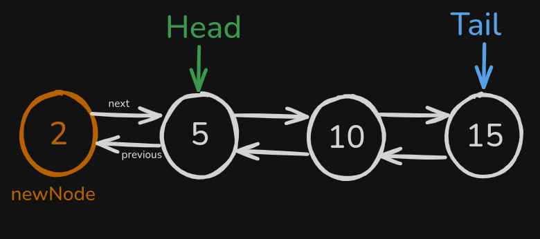

# Linked List & Doubly Linked List & Circular Linked List

para iniciar nosso Doubly Linked List vamos começar criando a classe dos Nodes, com value, previous e next:

```tsx
class LinkedListNode {
  value: number;
  next: LinkedListNode | null;
  previous: LinkedListNode | null;

  constructor(value: number) {
    this.value = value;
    this.next = null;
    this.previous = null;
  }
}
```

por que uma doubly linked list é ter o valor do nó atual, a referencia do próximo e a do anterior:


agora vamos criar a classe que vai implementar os métodos, iniciando com

head e tail:

```tsx
class DoublyLinkedList {
  head: LinkedListNode | null;
  tail: LinkedListNode | null;

  constructor() {
    this.head = null;
    this.tail = null;
  }
}
```

onde o `head`é o primeiro elemento e `tail` é o ultimo elemento.

o primeiro método que vamos implementar é o de adicionar um node na frente, ou seja, o primeiro elemento.

começamos criando um node e apontando o proximo node para o atual em que estamos:

```tsx

    public addToFront(value: number) {
        let newNode = new LinkedListNode(value);
        newNode.next = this.head;
    }
```

de forma visual o que fizemos foi:


agora vamos verificar se existe um head, se existir passamos o valor de previous para o novo node:

```tsx

    public addToFront(value: number) {
        let newNode = new LinkedListNode(value);
        newNode.next = this.head;

        if (this.head) {
            this.head.previous = newNode
        }
    }
```

de forma visual:



e se não tiver head, passamos o tail como o novo node, pois não existe previous e next, pois é o unico elemento.

e por fim retornamos o head com o novo node:

```tsx
    public addToFront(value: number) {
        let newNode = new LinkedListNode(value);
        newNode.next = this.head;

        if (this.head) {
            this.head.previous = newNode
        } else {
            this.tail = newNode
        }

        this.head = newNode

    }
```

para adicionar ao final fazemos a mesma coisa, porem invertemos:

```tsx
 public addToEnd(value: number) {
        let newNode = new LinkedListNode(value);
        newNode.previous = this.tail;

        if (this.tail) {
            this.tail.next = newNode
        } else {
            this.head = newNode
        }

        this.tail = newNode
    }
```

onde no final fica se tiver tail, deve ficar assim, onde `tail` estava no 15 e foi para o novo node:


agora para remover o primeiro, vamos verificar se existe um head, se não tiver, nosso linked doubly linked list está vazio, podemos retornar

```tsx
    public removeFromFront() {
        if (!this.head) {
            return;
        }
    }

```

após essa verificação vamos guardar a referencia do valor atual:

```tsx
    public removeFromFront() {
        if (!this.head) {
            return;
        }

        let removedValue = this.head.value
}
```


depois definimos o head como o proximo do head:

```tsx
    public removeFromFront() {
        if (!this.head) {
            return;
        }

        let removedValue = this.head.value
        this.head = this.head.next

    }

```


e por ultimo removemos a referencia do node anterior e retornamos o valor que armazenamos em `removedValue`:

```tsx
  public removeFromFront() {
        if (!this.head) {
            return;
        }

        let removedValue = this.head.value
        this.head = this.head.next

        if (this.head) {
            this.head.previous = null
        }

        return removedValue
    }

```


e para o tail a mesma coisa, porem com as informações invertidas:

```tsx
    public removeFromTail() {
        if (!this.tail) {
            return;
        }

        let removedValue = this.tail.value
        this.tail = this.tail.previous

        if (this.tail) {
            this.tail.next = null
        }

        return removedValue
    }
```
