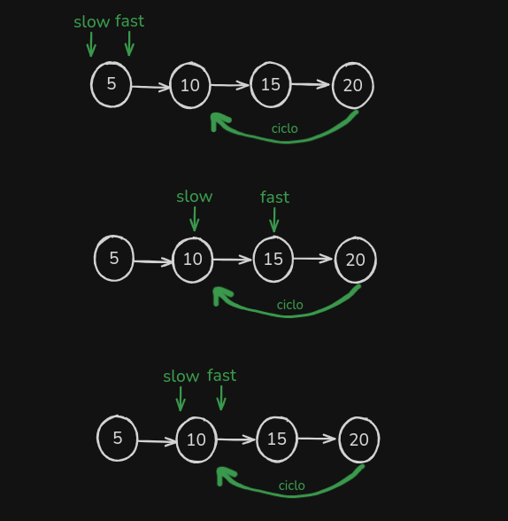

## Encontrar ciclos em um Linked List

para encontramos ciclos vamos usar a mesa idea que usamos para encontrar o meio. Vamos ter dois ponteiros `slow` que anda uma casa e `fast` que anda sempre 2.

se por acaso o `slow` se encontrar com `fast` seguinifica que encontramos um ciclo, visualemente é fica assim:



no codigo vai ficar assim:

```tsx
/**
 * Definition for singly-linked list.
 * class ListNode {
 *     val: number
 *     next: ListNode | null
 *     constructor(val?: number, next?: ListNode | null) {
 *         this.val = (val===undefined ? 0 : val)
 *         this.next = (next===undefined ? null : next)
 *     }
 * }
 */

function hasCycle(head: ListNode | null): boolean {
  let slow = head;
  let fast = head;

  while (fast && fast.next) {
    slow = slow.next;
    fast = fast.next.next;

    if (slow === fast) {
      return true;
    }
  }

  return false;
}
```
