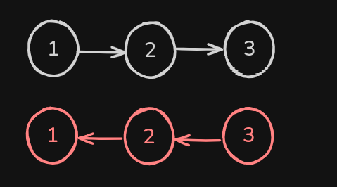
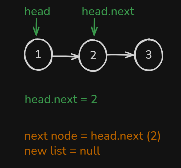
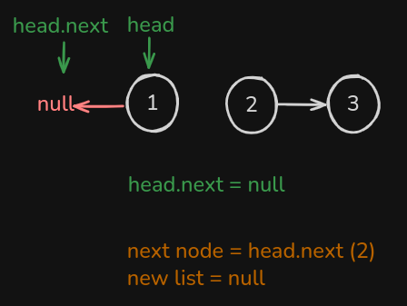
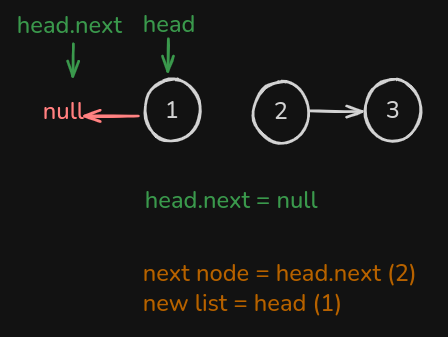
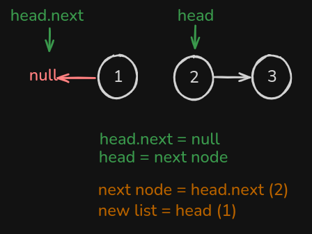

# Inverter uma Linked List

para invertermos uma linked list percorrendo uma unica vez, nos vamos basicamente inverter os ponteiros, isso significa visualmente isso:



para começar criamos duas novas variaves auxiliares, que são elas `nextNode` e `newList`, ambas começando como `null`.

para invertemos a linked list vamos executar um loop até que exista um `head`. A logica basicamente é começar guardando o proximo item que vem no `head.next`, ficando visualmente assim:



onde definimos a variavel `next node = head.next`, variavel que vamos usar posteriormente.

o proximo passo é desconectar a referencia do proxima, `head.next,` e conectar com anterior, que nesse caso não existe, portanto é `null,` ou seja `new list:`



o passo seguinte é atualizar o valor de `newList` com o `head` atual:



o proximo é definir o novo `head` como `nextNode`, que é o valor de `head.next` incial.



isso vai se repetir até o `head` ser null, ou seja, terminar de percorrer o linked list, e no final so retornamos o newList.

o codigo final fica assim:

```tsx
// Classe auxiliar
//class ListNode {
//    value: number | null
//    next: ListNode | null
//
//    constructor(value: number, next?: ListNode) {
//        this.value = value ?? null
//        this.next = next ?? null
//    }
//}

function reverseLinkedList(head: ListNode | null) {
  let nextNode: null | ListNode = null;
  let newList: null | ListNode = null;

  while (head) {
    nextNode = head.next;
    head.next = newList;
    newList = head;
    head = nextNode;
  }

  return newList;
}
```
