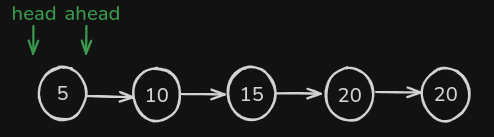
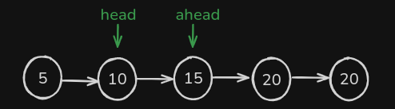
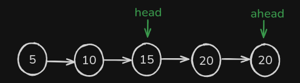
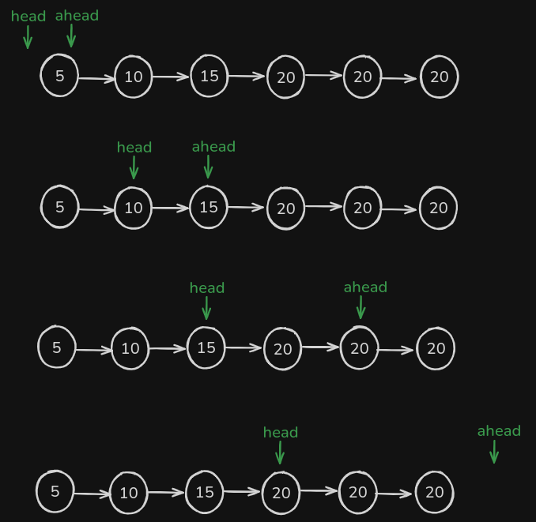

## Encontrar o meio de uma Linked List

para encontrarmos o meio vamos ter dois ponteiros, o `head` e o `ahead`, onde o head ja vem como parametro e ahead é a copia do head.

basicamente o que vamos fazer é sempre fazer o `ahead` andar o dobro do head, assim quando o `ahead` parar retornamos o `head` que vai estar no meio.

vamos começar com os dois ponteiros no mesmo lugar:



o `head` vai andar 1 e o `ahead` vai andar o dobro:



repte o mesmo processo, `head` anda 1 e `ahead` anda 2:



como não tem nada no algoritimo, ele termina aqui, basta retornamos o head.

em quantidade pares tambem ira funcionar, por que, o ahead vai sair da linked list, ficando null e o looop vai encerrar:



no código fica assim:

```tsx
/**
 * Definition for singly-linked list.
 * class ListNode {
 *     val: number
 *     next: ListNode | null
 *     constructor(val?: number, next?: ListNode | null) {
 *         this.val = (val===undefined ? 0 : val)
 *         this.next = (next===undefined ? null : next)
 *     }
 * }
 */

function middleNode(head: ListNode | null): ListNode | null {
  let ahead = head;

  while (ahead && ahead.next) {
    ahead = ahead.next.next;
    head = head.next;
  }

  return head;
}
```
