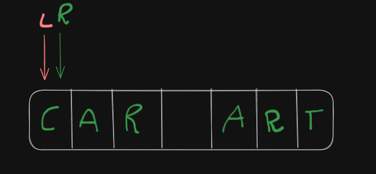
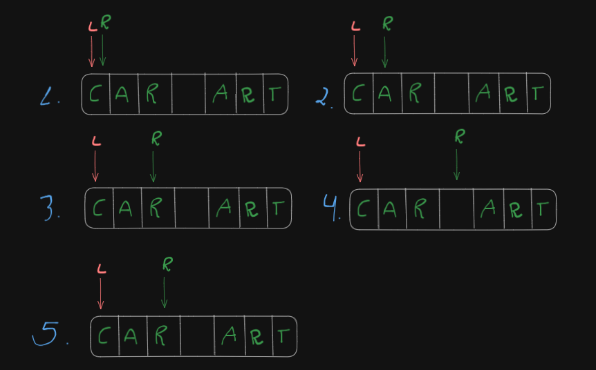
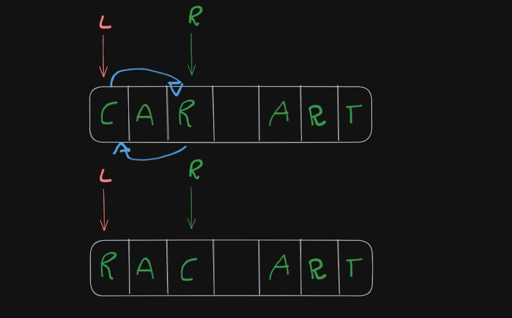
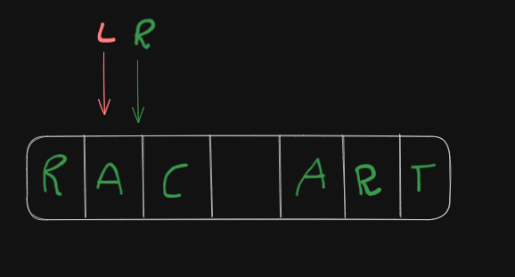
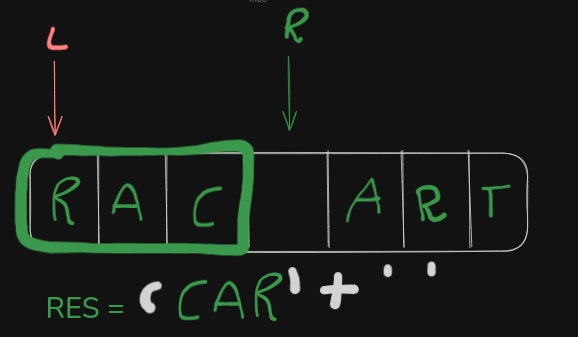
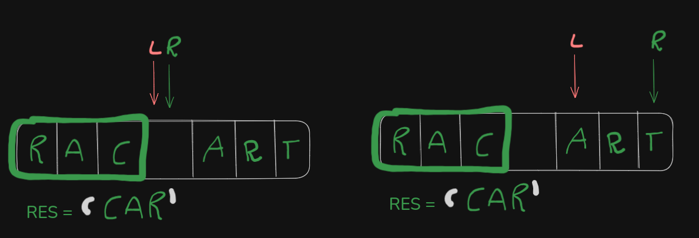
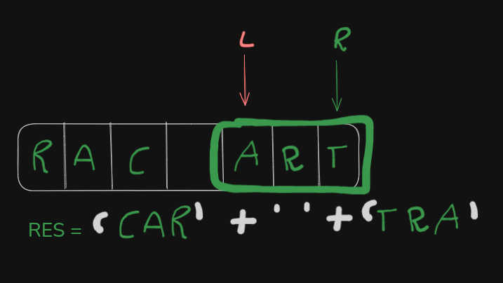
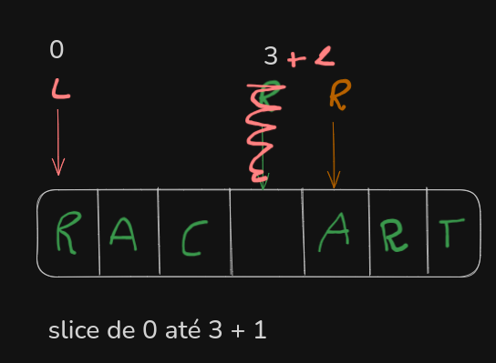

## Two Pointer

é normalmente usada em string ou arrays, ela consiste em incializar dois ponteiros um no inico e outro no final e manipular esses ponteiros para não ter que alocar mais espaço na memoria.

por exemplo, vamos receber um texto e queremos inverter todas as palavras desse texto. Para resolver começamos colocando os ponteiros no inicio(L)(R):



agora vamos mover o “R” até encontrar um espaço vazio, ao encontrar voltamos um:



agora trocamos os items dos ponteiros de lugar: R ⇒ C e C ⇒ R:



e movemos o ponteiro até que ambos se encontrem:



depois caminhamos os dois ponteiros para o espaço em branco, e em seguida movemos o r até o espaço em branco ou até o final da palavra e repete o processo anterior até o R chegar no final do array.

maaaas, isso funciona onde a linguagem considera a string com um array. No Typescript a string é imutavel, portanto requer uma solução diferente:

começamos da mesma maneira, encontrado o espaço vazio. ao encontrar vamos pegar esse pedaço, inverter e adicionar em uma variavel :



depois movemos o “L” para o espaço vazio e em seguida “L” para o proxima letra e o “R” para o espaço ou para o final:



ao encontrar a palavra revertemos a concatenamos na variavel:



no código fica assim:

```tsx
function invertWord(word: string) {
  let res = "";
  let leftPointer = 0;
  let rightPointer = 0;

  while (rightPointer < word.length) {
    if (word[rightPointer] != " ") {
      rightPointer++;
    } else {
      res += word
        .slice(leftPointer, rightPointer + 1)
        .split("")
        .reverse()
        .join("");
      rightPointer++;
      leftPointer = rightPointer;
    }
  }

  res += " ";
  res += word
    .slice(leftPointer, rightPointer + 2)
    .split("")
    .reverse()
    .join("");

  return res.slice(1, word.length + 1);
}

console.log(invertWord("rac art"));
console.log(invertWord("eduardo jaskowiak fronza"));
```

verificamos se onde o ponteiro está na string é diferente de vazio, se for vai recortar o item de 0 até 3 + 1, nesse caso vai ficar “RAC “:



- split ⇒ para transformar em um array
- reverse ⇒ inverter o array
- join ⇒ para juntar tudo

depois movemos o ponteiro da direita um para frente e o da esquerda para mesma posição.

na ultima etapa vamos adicionar um espaço em branco e fazermos o mesmo processo de reverter, porem ao inves de 1 vamos usar dois pois quando o loop acaba, o rightPointer já está **parado no último caractere da palavra**.

Se usasse rightPointer + 1, o slice pegaria só até o último índice

**inclusivo**, mas como o slice não inclui o índice final, eu perderia a última letra
