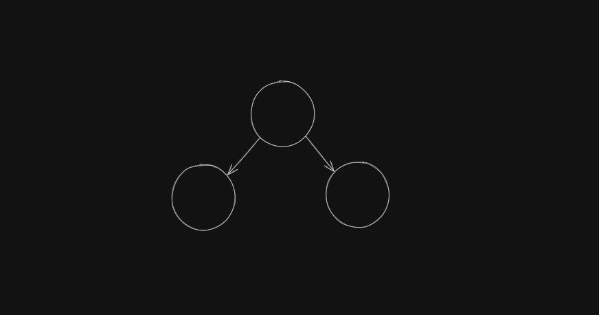
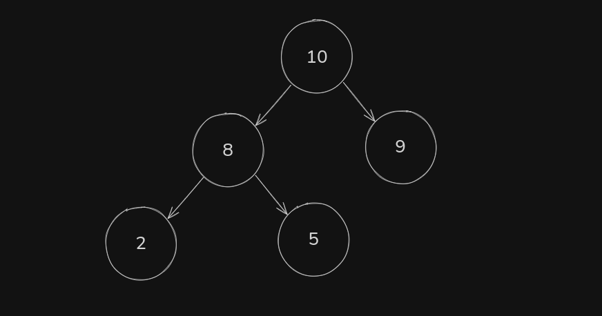

# Binary Tree

é estruturada em Node, Left, Right que tambe são nodes, de forma visual fica assim:

é simples de enteder, mas implementação é mais complexa.

### Heap

é um tipo de Binary Tree onde pode ser min heap ou um max heap

um **min heap** siginifica que o valor do topo é o minimo, os seguintes serão maiores ou iguais:

um **max heap** siginifica que o valor do topo é o maior, os seguintes serão menores ou iguais:

