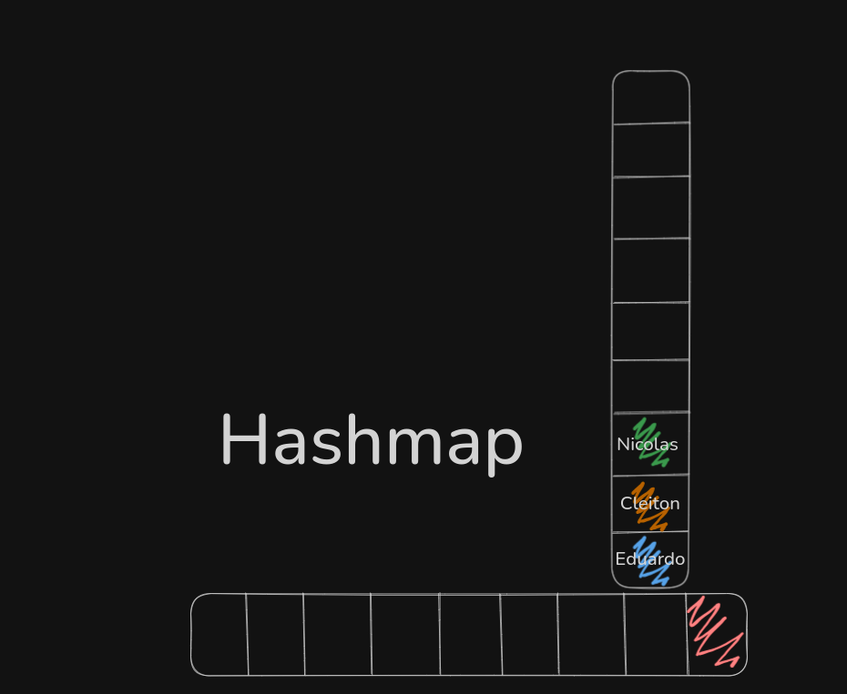

# Hashmap

é um estrutura de dados que armazena **chave ⇒ valor,** permitindo acesso rápido aos elementos usando chave única.

se fizemos usando um array normal, O(n), seria fácil de encontrar o valor, porem nada performatico. A questão do hasmap é jusamente essa, buscar o valor que queremos em uma em **tempo constante**, ou seja, coplexidade MÉDIA de O(1).

Mas como exatamente isso é feito em um HashMap com 10.000 mil elementos?

### Hash Function

em uma Linked List não é possivel sabermos exatamente onde está o elemento, masss… em um array conseguimos, desde que sabemos a posição deles.

é exatamente esse problema que a Hash Function resolve, vai pegar o input (chave que estamos procurando) e vai fazer alguma operação matematica que vai transformar ela no slot do array onde está armazenado o item que quermos.

de forma simples vai transforma a chave “Eduardo” em 7

e a chave “Bernardo” em 8

e armazenar esse valor na memoria

porem não tão simples assim, e nunca vai armazenar apenas o tamanho da string ou algo assim. Vai usar um `SHA-256` ou `MD5`, algo nesse sentido.

dessa forma nossa Hash Function vai transformar nossa string em um numero enorme, agente divide pelo tamanho do nosso array.

e nesse momento que entra as “Collision”, pois duas chaves diferentes podem ter hashes que, ao fazer divisão pelo tamanho do array, resultem em um mesmo indice, por exemplo:

cleiton tambem tem 7 letras, como prosseguimos?

### Load Factor

é um número que indica quando o **HashMap** deve aumentar de tamanho para evitar muitas colisões, na maioria das linguagens é 0.70 (70%) do hash preenchido.

quando esse limite é atingido o HashMap dobra de tamanho, esse processo envolve o “re-hashing”: recalcular o índice de cada chave para os novos slots.

### Collision

primeiro de tudo, não armazenamos apenas o azul, armazenamos chave e valor (”eduardo, “azul”), que serve para solucionar colisões, e para onde vai os hash’s que derem no mesmo lugar?

antigamente ele percorria todo restante do array para encontrar o proximo slot vazio na memoria, se tornando um O(n), porem isso já não mais tão comum.

atualmente, na posição onde aconteceu a colisão vamos apontar para outra estrutura de dados, seja um array ou uma linked list, ficando de forma visual assim:

e por que essa solução é mais rapida?

por que imagina em uma array de 10.000 mil items o quão rapido é encontrar a posição que vai ter a sublista de items. Na nossa sublista, no pior dos casos vamos ter um O(n), essa lista é para ter poucos elementos, portanto mesmo assim será muito rápido.

