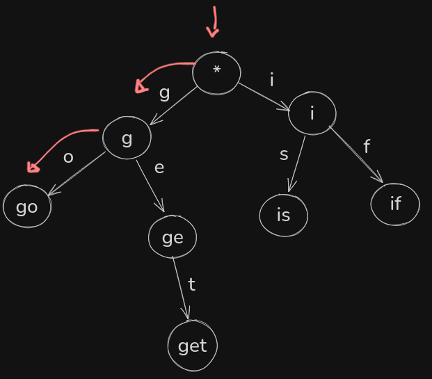

## Trie

é um tipo de arvore, tambem conhecida como prefix - tree, isso quer dizer que conforme vamos percorrendo os nós para baixo, vamos mantendo o estado do anterior.

um exemplo é um autocomplete, onde temos duas palavaras cadastradas: “go” e “get”. Ao digitarmos a primeira letra “g” ele tem dois caminhos “e” ou “o”, se seguir no “o” chega na palavra “go”:

## B-Tree

é essencialmente uma arvore auto balanceavel que seguem algumas regras:

- definir o numero de chaves (keys)
- children sempre vai ser um a mais da quantidade de chaves

é mais simples olhar em um visualizador de b-tree para ter uma noção de como funciona
